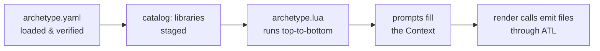

# Anatomy of an Archetype

A fully-featured archetype looks like this:

```text
my-archetype/
├── archetype.yaml        # Manifest (required)
├── archetype.lua         # Script — entry point
├── interface.yaml        # Declarative input contract (optional)
├── contents/             # Templated content (name is by convention)
│   └── {{ project_name }}/
│       ├── README.md
│       └── src/…
├── includes/             # ATL template fragments for 
│   └── header.atl
├── lib/                  # Lua modules (require-able by scripts)
│   └── helpers.lua
└── README.md             # For humans browsing the repository
```

Only the manifest is strictly required; everything else exists in service of what your archetype actually does.

## `archetype.yaml` — the manifest

Identity, requirements, engine configuration, and (optionally) a catalog of dependencies:

```yaml
description: "Rust CLI application"
summary: "Scaffolds a Rust CLI binary using clap derive macros."
authors: ["Jane Developer <jane@example.com>"]
languages: ["Rust"]
frameworks: ["clap"]
tags: ["rust", "cli"]

requires:
  archetect: "3.0.0"

templating:
  trim_blocks: true
  lstrip_blocks: true
```

- `description` appears in catalog menus and search results; `summary`, `languages`, `frameworks`, and `tags` feed `archetect search`.
- `requires.archetect` is the minimum Archetect version.
- `templating` tunes the ATL engine — see [Templating Configuration](./templating/configuration).
- A `catalog:` section declares composed archetypes and libraries — see [Composition](./scripting/composition).

Full schema: [Archetype Manifest reference](../reference/archetype-manifest).

## `archetype.lua` — the script

The script is your archetype's `main()`. It runs top-to-bottom when the archetype renders, with the whole [Lua API](../reference/lua-api/) available as globals — no imports needed for the core:

```lua
local context = Context.new()

context:prompt_text("Project Name:", "project-name", {
  cases = Cases.programming(),
})

directory.render("contents", context)
```

Everything interesting about scripting has its own page under [Scripting with Lua](./scripting/).

## Content directories

Directories of templates, rendered with `directory.render("<name>", context)`. The name is up to you — `contents/` is the common convention — and you can have several, rendered conditionally:

```lua
directory.render("contents", context)
if archetype.switches.is_enabled("docker") then
  directory.render("docker", context)
end
```

Within a content directory, **everything is a template**: file contents *and* file/directory names (`{{ project_name }}/` becomes `rocket-launcher/`).

## `includes/` — shared template fragments

Fragments referenced from templates with ``. Your archetype's own `includes/` is automatically on the search path, and libraries you mount contribute theirs — see [Organizing Templates](./templating/organizing-templates).

## `lib/` — Lua modules

Lua files that your script (or consumers of your archetype, in library mode) can `require`. This is how larger archetypes stay organized and how [Libraries](./scripting/libraries) share logic across an organization.

## `interface.yaml` — declarative inputs

An optional, machine-readable declaration of your archetype's prompts and switches, letting web portals and AI agents build input forms without running the script. See [Declarative Interfaces](./interface).

## How it all executes



The manifest loads first (requirements are checked, `library: true` catalog entries are staged), then the script runs, prompting and rendering as it goes. When the script ends, the render is complete.
