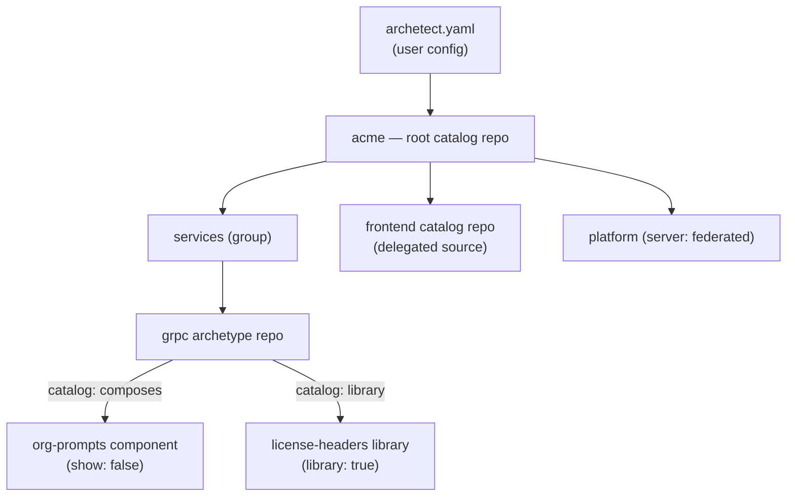

# Advanced Composition

Beyond menus, catalogs are the *dependency mechanism* of the archetype ecosystem: archetypes declare the components and libraries they build on in their own `catalog:` sections. This page collects the patterns that emerge at scale.

## Components: archetypes meant for composition

A **component** is an archetype designed to be rendered *by other archetypes* — a shared prompt set, an `xtask/` crate, a CI workflow bundle. Convention:

- Marked `show: false` wherever it's cataloged.
- Renders into the destination root, so it works standalone; parents aim it with `catalog.render(..., { destination = dir })`.
- Documents the context keys it reads and writes — that's its API.

```yaml
# In a consuming archetype's manifest
catalog:
  xtask:
    description: "xtask workspace crate"
    source: "https://github.com/archetect-rust/rust-xtask-component.git"
    show: false
    answers:
      xtask_embedded: true
```

```lua
context:merge(catalog.render("xtask", context, { destination = project_dir }))
```

## Libraries: staged, not rendered

Adding `library: true` changes an entry's nature: instead of (or in addition to) being renderable, it's resolved *at load time* and its `lib/` and `includes/` are staged into the consumer's runtime under the entry's name. `library` and `show` are independent — a library can appear in menus if it has a useful standalone mode.

```yaml
catalog:
  license-headers:
    description: "License header partials"
    source: "https://github.com/archetect-common/license-headers-library.git"
    library: true
    show: false
```

See [Libraries](../authoring-archetypes/scripting/libraries) for the consumption side.

## Layered pre-configuration

Because entries pre-configure whatever they point at — and catalogs nest — configuration layers naturally:

```yaml
catalog:
  services:
    description: "Backend Services"
    catalog:
      grpc:
        description: "gRPC Service"
        source: "git@github.com:acme/rust-grpc-archetype.git"
        answers:
          org_name: acme          # organization-wide constants
        switches: ["github-actions"]
        use_defaults: ["license"] # our license default is always right
```

The archetype stays generic; the catalog encodes *your* policy. Different organizations (or teams) wrap the same archetype with different answers — reuse without forks.

## Federated catalogs

A `server:` entry mounts a subtree served by a remote Archetect server — the entry behaves as a group whose children are fetched on demand, and renders dispatch to the remote:

```yaml
catalog:
  platform:
    description: "Acme Internal Platform"
    server:
      endpoint: "https://archetect.acme.corp:8443"
      tls:
        ca: "/etc/archetect/acme-ca.crt"
```

This keeps centrally-governed archetypes centrally-executed (the server owns the archetype sources and their evolution), while consumers still get the one-tree experience. TLS settings fall back to the `client.tls` section of the consumer's configuration when omitted. See [Server Modes](../reference/cli/server-modes) for running the server side.

## The ecosystem picture



One mental model covers it all: **everything is an archetype; catalogs are how archetypes point at each other** — for menus, for composition, for libraries, and across servers.
