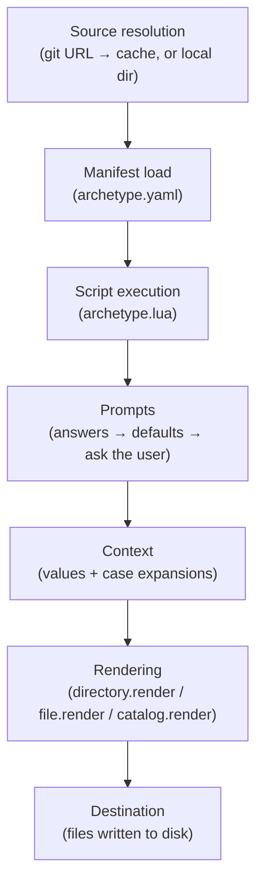

# Core Concepts

Five ideas explain almost everything Archetect does: **archetypes**, **templates**, **prompts and context**, **catalogs**, and **the render pipeline** that ties them together.

## Archetypes

An *archetype* is a directory — usually a git repository — that describes how to generate something. A minimal archetype contains:

```text
my-archetype/
├── archetype.yaml     # Manifest: description, requirements, metadata
├── archetype.lua      # Lua script: prompts and orchestration
└── templates/         # Content to render (every file is a template)
    ├── README.md
    └── src/
        └── main.rs
```

- **`archetype.yaml`** declares what the archetype is (description, authors, tags) and what it needs (`requires: archetect: "3.0.0"`).
- **`archetype.lua`** runs when the archetype renders: it prompts the user, computes values, and decides what to render where.
- **Content directories** (like `templates/`) hold the files to generate. File contents *and* file names are templates.

## Templates (ATL)

Archetype content is rendered with the **Archetect Template Language (ATL)** — a Jinja2-style engine. Variables use `{{ ... }}`, logic uses ``:

```jinja
# {{ project-title }}


See `Dockerfile` for container builds.

```

Filters transform values, and Archetect's filters are tuned for code generation:

```jinja
struct {{ project-name | pascal_case }} {}     →  struct MyProject {}
const {{ project-name | constant_case }}: …    →  const MY_PROJECT: …
```

## Prompts, answers, and context

When an archetype needs information, its script prompts for it:

```lua
local ctx = Context.new()
ctx:prompt_text("Project Name:", "project-name", {
  cases = Cases.programming(),
})
```

Answers land in a **Context** — the bag of variables handed to every template. With `cases`, one answer automatically expands into every casing a codebase needs (`my-project`, `my_project`, `MyProject`, `myProject`, `MY_PROJECT`, …).

Prompts don't have to be interactive. Every prompt can be **answered in advance** — from `-a key=value` flags, answer files (`-A answers.yaml`), or catalog configuration — which is how Archetect runs in CI (`--headless`).

**Switches** (`-s docker`) are named flags that archetypes use to toggle optional functionality.

## Catalogs

A *catalog* organizes archetypes into a browsable menu tree, declared in YAML:

```yaml
catalog:
  rust:
    description: "Rust Ecosystem"
    catalog:
      cli:
        description: "Rust CLI application"
        source: "https://github.com/your-org/rust-cli-archetype.git"
```

Catalogs nest, reference other catalogs by git URL, and are themselves just archetypes with a `catalog:` section — it's archetypes all the way down. Running `archetect` with no arguments opens your configured catalog as an interactive menu; `archetect rust/cli` jumps straight to an entry by path.

## The render pipeline

Putting it together, here is what happens when you run `archetect render <source> <destination>`:



1. **Resolve the source.** Git URLs are cloned into Archetect's cache (`~/.cache/archetect`) and reused offline; local paths are used directly.
2. **Load the manifest** and verify version requirements.
3. **Run the script.** Each prompt resolves in priority order: explicit answers → configured defaults → interactive input. In `--headless` mode, unresolved prompts are an error instead of a question.
4. **Render content.** The script calls `directory.render("templates", ctx)` (and friends), and ATL renders every file — names and contents — against the context.
5. **Write to the destination**, honoring existing-file policy (preserve by default) — or nowhere, with `--dry-run`.

## Vocabulary at a glance

| Term | Meaning |
|---|---|
| **Archetype** | A renderable blueprint: manifest + script + templated content |
| **Manifest** | `archetype.yaml` — description, requirements, metadata, optional catalog |
| **Context** | The variable map passed to templates; filled by prompts and script logic |
| **ATL** | Archetect Template Language — the Jinja2-style template engine |
| **Catalog** | A menu tree of archetypes, navigable interactively or by path |
| **Answer** | A pre-supplied value for a prompt (flag, file, or configuration) |
| **Switch** | A named on/off flag archetypes use to gate optional behavior |
| **Library** | An archetype mounted by another to share Lua modules and template fragments |

## Next step

Time to generate something real: the [Quick Start](./quick-start).
